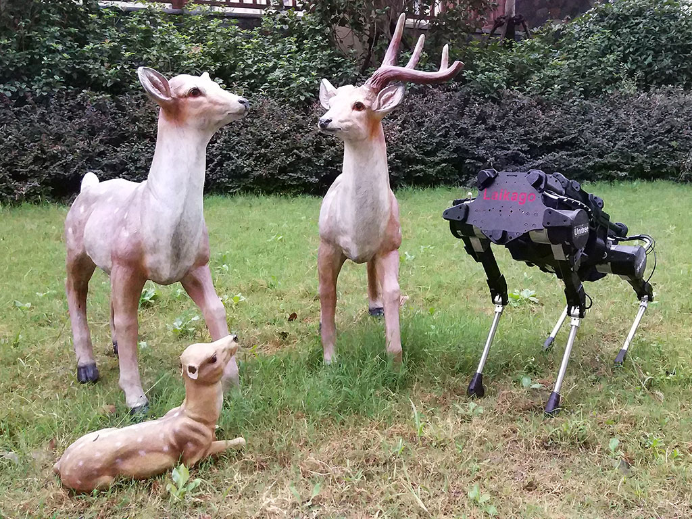
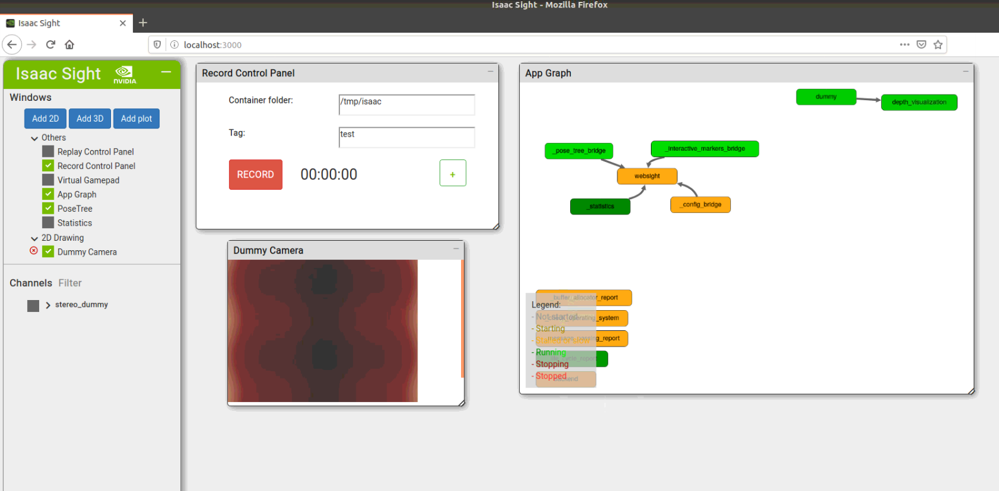
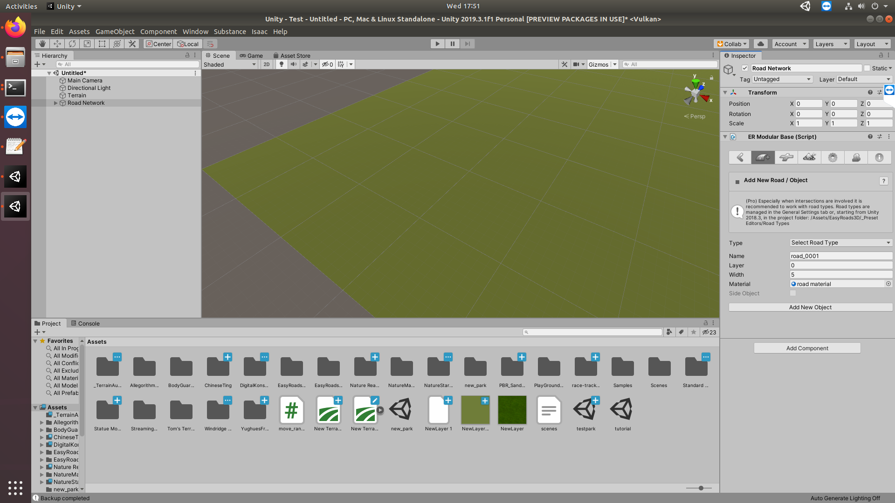
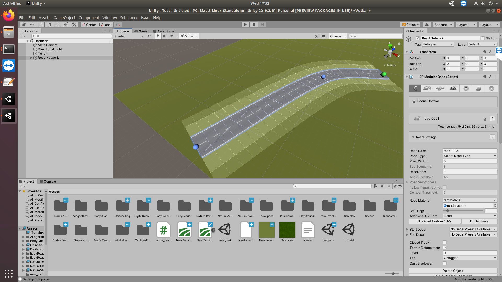

last updated Tue Jun 16 11:42:36 +08 2020

# Simulation for Robotics
summer 2020 ARC simulations for nvidia's isaac_sdk. This document serves as a basic installation/quickstart guide.
The relevant commands have been extracted out, please follow the links provided for further reading if required.



- [Simulation for Robotics](#simulation-for-robotics)
  - [Motivation](#motivation)
    - [System Requirements](#system-requirements)
    - [Isaac & Isaac Sim SDK](#isaac--isaac-sim-sdk)
    - [Simulation Environment: UnityHub and Unity 3D](#simulation-environment-unityhub-and-unity-3d)
    - [Troubleshooting Tips/Hacks](#troubleshooting-tipshacks)
  - [B: Testing Your Setup](#b-testing-your-setup)
  - [C: Basic Workflow](#c-basic-workflow)
    - [1. Running Scenes in Play/Build Mode](#1-running-scenes-in-playbuild-mode)
    - [2. Editing 3D Scenes in Unity Editor](#2-editing-3d-scenes-in-unity-editor)
  - [D: Codelets and Apps](#d-codelets-and-apps)
    - [IsaacSight Related](#isaacsight-related)
    - [Setting up Virtual Gamepad](#setting-up-virtual-gamepad)
    - [Segmentation Training](#segmentation-training)
  - [E: Collaboration Tools](#e-collaboration-tools)
    - [Unity's Collaboration  Features](#unitys-collaboration-features)
    - [Making/Modifying Assets](#makingmodifying-assets)
      - [Sources For Assets](#sources-for-assets)
      - [MapsSDK](#mapssdk)
      - [EasyRoads3D](#easyroads3d)
      - [other smol stuff](#other-smol-stuff)
  - [F: Todos](#f-todos)


### Motivation

The training of models benefits from simulations. We are able to generate unlimited data for the training of these models,
and have them all labelled in detail. Furthermore, we are able to randomise the light, materials, textures and colour of
our simulated objects. These should allow us to train and test our robots in a safe and controlled environment.
  
### System Requirements and Software Versions Tested
* Ubuntu 18.04 LTS
* GPU with [compute capability](https://developer.nvidia.com/cuda-gpus) of 3.5 or higher


***Software Versions***:
the following are versions that we have tested with successfully: 

* UnityEditor Version: 2019.3.0, 2019.3.1, 2019.3.15
* Isaac SDK: 2020.1
* Bazel Version: 0.19.2, 2.0.0, 2.2.0
* Cuda: 10.0


### [Isaac & Isaac Sim SDK](https://docs.nvidia.com/isaac/isaac/doc/setup.html#setup-isaac)
1. [Download](https://developer.nvidia.com/isaac/downloads) Isaac SDK 2020.1 and Isaac Sim (for Navigation) 2020.1, then extract the files to your home folder. (name them `~/isaac` and `~/isaac_sim_unity3d` respectively) Also, you will to make an NVIDIA account before you can proceed to download.
2. Ensure current version of NVIDIA GPU driver is version 440. To install, run the following commands in terminal

```bash
sudo add-apt-repository ppa:graphics-drivers/ppa
sudo apt-get update
sudo apt-get install nvidia-driver-440
```
3. From the root folder of Isaac SDK, run the dependency script. This will install the required dependecies

``` bash
bob@desktop:~/isaac$ engine/build/scripts/install_dependencies.sh
```

### Simulation Environment: UnityHub and Unity 3D
1. Download [UnityHub AppImage](https://unity3d.com/get-unity/download). 
2. Give the AppImage executable permissions. In terminal, navigate to the folder containing UnityHub.AppImage and run the following command.
   
``` 
chmod +x UnityHub.AppImage
```
3. To open UnityHub, run the executable in terminal
```
./UnityHub.AppImage
```
4. Sign in to Unity Hub and activate personal or pro licence. Pro licence is available as part of the [github student developer pack](https://education.github.com/pack)
5. Run the following command in terminal to install Unity 2019.3.0f6 (no additional modules required).
```
./UnityHub.AppImage unityhub://2019.3.0f6/27ab2135bccf
```

### Troubleshooting Tips/Hacks
- Unable to build isaac app
  - Bazel version has to be 2.x. To check, run the following command in terminal. Running the dependency script again should fix this.
  ```
  bazel --version
  ```
- Unable to run NavSim
  - Cuda package's version has to be specifically 10.0, be careful when running `sudo apt update && upgrade` on your packages as this may upgrade cuda to a newer version. To check current version of Cuda, run the following command in terminal
  ``
  cat /usr/local/cuda/version.txt
  ``

- Unity unable to start
  - You may be missing a dependency. ``sudo apt install libgconf-2-4``

- Unable to import Sample Project into Unity
  -Follow the instructions [here](https://forums.developer.nvidia.com/t/isaac-sim-2020-1-unity-3d-unable-to-open-sample-project/126047). Delete the 4 files mentioned.

- Nvidia graphics driver installation failed.
  - You might have an older version of the driver. Remove old nvidia driver and try again

#### Others
- Ensure correct version of dependencies Bazel 2.x, CUDA 10.0, CUDNN 7.6.3, and TensorRT 6.0

- Substance plugin missing
  - Ensure ``Allogerithmic`` folder is present in your assets file. If missing, copy it from ``isaac_sim_unity3d/projects/sample/Assets``.
  
 - Logfile not printing to terminal, error message ``CreateDirectory '' failed:  (current dir: )`` shown.
  - modify the -logfile flag to ``-logfile /dev/stdout``
  
 - Visit [Isaac 2020.1 FAQ](https://docs.nvidia.com/isaac/isaac/doc/faq.html) and [Isaac SDK forum](https://forums.developer.nvidia.com/c/agx-autonomous-machines/isaac/sdk/68) for help :)

## B: Testing Your Setup

Firstly get the dummy app built and running like so: 

```bash
bob@desktop:~/isaac$ bazel build //apps/samples/stereo_dummy # <--- builds the sample app (an app only needs to be built once)
bob@desktop:~/isaac$ bazel run //apps/samples/stereo_dummy   # <--- runs the sample app
```

Following which, we should be able to view the app on IsaacSight, on your browser, go to `http://localhost:3000`

If everything is working, we should see the map view widgets with a non-black screen:




kill it from the terminal by doing a `Ctrl-C`


## C: Basic Workflow

### 1. Running Scenes in Play/Build Mode


***Play Mode*** invovles the running of a executable that represents the scene. This executable is [generated upon building a scene](https://docs.nvidia.com/isaac/isaac/doc/simulation/unity3d.html#build). We can open up Unity3D in play mode like so: 

```bash
bob@desktop:~/isaac_sim_unity3d$ cd builds 
bob@desktop:~/isaac_sim_unity3d/builds$ ./sample.x86_64 --scene small_warehouse -logFile /dev/stdout/ #indicating stdout allows us to view the debug info 
```

***Build Mode*** 

```bash
# e.g. of UnityEditorVersion: 2019.3.0f6
bob@desktop:~$: Unity/Hub/Editor/<UnityEditorVersion>/Editor/Unity -projectPath isaac_sim_unity3d/projects/sample -logfile 
```

### 2. Editing 3D Scenes in Unity Editor


Our projects will be within the `isaac_sim_unity3d` dir.
Nvidia-specific packages and assets (e.g. carter robot) can be copied over from sample scenes.

```bash
bob@desktop:~/isaac_sim_unity3d$ mkdir projects/test # creating a test project dir
bob@desktop:~/isaac_sim_unity3d$ cp -r projects/sample/Assets projects/sample/Packages projects/sample/ProjectSettings projects/test/ 


# opens project from cli
bob@desktop:~/isaac_sim_unity3d$ ~/Unity/Hub/Editor/2019.3.0f6/Editor/Unity -projectPath projects/test -logfile /dev/stdout/
```
Opening up a scene in Build Mode will open up UnityEditor for you. If you prefer GUIs, you can open up Unity Hub (the appImage) and select projects from there itself.

Now we can edit as we please. Please follow [this tutorial](https://docs.nvidia.com/isaac/isaac/doc/simulation/unity3d.html#create-a-new-project) to understand how to create scenes.

When done, running that scene requires us to click the play button from the editor itself:


Scenes vs Scenarios: TODO


## D: Codelets and Apps

### IsaacSight Related

### [Setting up Virtual Gamepad](https://docs.nvidia.com/isaac/isaac/packages/navigation/doc/virtual-gamepad.html#virtual-gamepad) - Controlling Carter using

We want to control our Robot's movements when a scene is playing. This involves modifying the application (e.g. `navsim` app that we will be running) such that the virtual gamepad widget on IsaacSight(the front end) may connect to our app (the backend). In short, this involves modifying the app codelet by first, adding the nodes, edges and config params to the json file that represents the app, followed by modifying the BUILD file by adding the "navigation" module.

the files are at this dir: `~/isaac/apps/navsim/`

We achieve this like so:

**1. to the json file** (`navsim_navigate.app.json`)
  * add this node: 
  ```json
  {
    "name": "virtual_gamepad_bridge",
    "components": [
      {
        "name": "message_ledger",
        "type": "isaac::alice::MessageLedger"
      },
      {
        "name": "VirtualGamepadBridge",
        "type": "isaac::navigation::VirtualGamepadBridge"
      }
    ]
  }
  ```

  * add this to the config section, including the param for `tick_period`:

  ```json
  "virtual_gamepad_bridge": {
    "VirtualGamepadBridge": {
      "tick_period": "100ms"
    }
  }
  ```


  * add the edges, these enable communication b/w the nodes:

  ```json
  {
    "source": "websight/WebsightServer/virtual_gamepad",
    "target": "virtual_gamepad_bridge/VirtualGamepadBridge/request"
  },
  {
    "source": "virtual_gamepad_bridge/VirtualGamepadBridge/reply",
    "target": "websight/WebsightServer/virtual_gamepad_reply"
  }
  ```   name = "...",
    ...
    modules = ["navigation"],
)
 

  * add the "navigation" module to the modules array
  ```json
  modules = ["navigation"]
  ```

**2. to the BUILD file**, add the "navigation" module into the modules array: 
  ```json
  isaac_app(
      name = "...",
      ...
      modules = ["navigation"],
  )
  ```
  
Now, run your chosen scene and the chosen app, go to IsaacSight via your browser and access the Gamepad Widget. Connect to the app and you should be able to move Carter around within the scene!

### [Free Space Segmentation](https://docs.nvidia.com/isaac/isaac/packages/freespace_dnn/doc/freespace_segmentation.html)

Isaac SDK includes the freespace_dnn package that makes it easy to train a free space DNN in simulation and subsequently use the model to run real world inference. 

#### Training the model in simulation

1. Launch tensorflow instance and train it with labelled images received over TCP
  ``bob@desktop:~/isaac$ bazel run packages/freespace_dnn/apps:freespace_dnn_training``
2. Run scenario 3 of medium warehouse scene by running the following command
  ```bash
  bob@desktop:~/isaac_sim_unity3d$ cd builds
  bob@desktop:~/isaac_sim_unity3d/builds$ ./sample.x86_64 --scene medium_warehouse --scenario 3
  ```
3. Press "C" key to disable the main camera, increasing simulation framerate. Logs and checkpoints are saved in ``/tmp/path_segmentation`` by default
4. To view training progress on Tensorboard ``tensorboard --logdir=/tmp/path_segmentation``
5. Once the training is complete, serialize the most recent checkpoint as a protobuf file with ``bob@desktop:~/isaac$ python3 packages/freespace_dnn/apps/freespace_dnn_training_freeze_model.py --checkpoint_dir /tmp/path_segmentation --output_nodename prediction/truediv --output_filename model.pb --output_onnx_filename model.onnx``
6. Using the model.onnx file that is generated, create a config file that looks like the packages/freespace_dnn/apps/freespace_dnn_inference_medium_warehouse_tensorrt.config.json file. You are now ready to perform inference.

#### Inference

freespace_dnn supports 4 different image sources.   

| Application Name                | Image Source            |
|---------------------------------|-------------------------|
| freespace_dnn_inference_image   | Image on Disk           |
| freespace_dnn_inference_replay  | Video on disk           |
| freespace_dnn_inference_v4l2    | Camera                  |
| freespace_dnn_inference_unity3d | Simulation with Unity3D |

Example running with image on disk as image source
1. ``bob@desktop:~/isaac$ bazel run packages/freespace_dnn/apps:freespace_dnn_inference_image -- --config inference:packages/freespace_dnn/apps/freespace_dnn_inference_medium_warehouse_tensorrt.config.json``
2. Open Isaac Sight at [http://localhost:3000/](http://localhost:3000/).

To change the image source, change ``color_filename`` parameter in ``freespace_dnn_inference_image.app.json``. To change
the pre-trained model being used, modify the parameter after the config flag to point to a json file representing your model.

To use the inference apps with a Unity scene, you have to additionally provide the config files that defines the camera teleportation parameters.
```bash
bob@desktop:~/isaac$ bazel run packages/freespace_dnn/apps/freespace_dnn_inference_unity3d -- --config inference:packages/freespace_dnn/apps/freespace_dnn_inference_medium_warehouse_tensorrt.config.json,packages/freespace_dnn/apps/freespace_dnn_inference_unity3d_medium_warehouse.config.json
```

## E: Collaboration Tools 

### Unity's Collaboration  Features

Unity Collab is Unity's own version control service. It's convenient to use and a setup for it is [described here](https://docs.unity3d.com/Manual/UnityCollaborateSettingUp.html).
It allows the syncing of 3D assets and other changes to the scenes. ***Note:*** only 3 people may use collab under the free service. 

Other version control systems are supported, including git, and using git would be beneficial.
[StackOverflow thread](https://stackoverflow.com/questions/18225126/how-to-use-git-for-unity3d-source-control) on git-Unity3D best practices.

**Suggestion:** consider dividing the asset-making todos and sync them using a github repo, while 3 people sync amongst each other on the Unity3D scenes

### Making/Modifying Assets 

Based on the supported [file types](https://docs.unity3d.com/Manual/3D-formats.html) for Unity3D, we have used `.fbx` files to create and import assets.

Blender is useful for this, but there's a learning curve. [Official Blender Fundamentals Playlist](https://www.youtube.com/playlist?list=PLa1F2ddGya_-UvuAqHAksYnB0qL9yWDO6)


*this donut took 2h*

#### Sources For Assets
Honestly, there's nothing good that's freely (and legally) available. Check out the assets subdir in this repo for some assets, add to it if you can.

You can check out this [site](https://www.hongkiat.com/blog/60-excellent-free-3d-model-websites/) for some open source models (only .fbx models can be imported into Unity3D).

#### MapsSDK
- Register for an account to be eligible for dwonloading the assets, there are no costs incurred.
- Follow this [guide](https://docs.mapbox.com/unity/maps/overview/) to show you the steps for installation and a few tutorials on how to utilize the sdk.

#### EasyRoads3D
EasyRoads3D is a plugin that provides an easy way to create roads in unity.

1. Download and Import ``EasyRoads3D Free v3`` from the Unity Asset Store.
2. Ensure you have a terrain game object. Else add a terrian game object ``GameObject -> 3D Object -> Terrain``
3. Add the EasyRoads3D asset ``GameObject -> 3D Object -> EasyRoads3D -> New Road Network``
4. Click on the Road Network Game Object created in the hierarchy. In the inspector on the right hand side, click the icon of road with a plus sign. Adjust parameters including road width and material.
5. Click Add New Object. You can now shift-click on the terrain to add markers. 

#### Other Assets that we used:

- NatureStarterKit2 (for greenery)
- PlayGround Pack (Low-poly 3D playground model) 
- Windridge City Assets 
- Prototyping Pack (for stairs and ramps)

## F: Todos

* [Establishing a ROS Bridge](https://docs.nvidia.com/isaac/isaac/packages/ros_bridge/doc/ros_bridge.html)

* [map creation in unity](https://docs.mapbox.com/help/tutorials/create-a-map-in-unity/)

* [NVIDIA Omniverse](https://developer.nvidia.com/nvidia-omniverse-platform)

