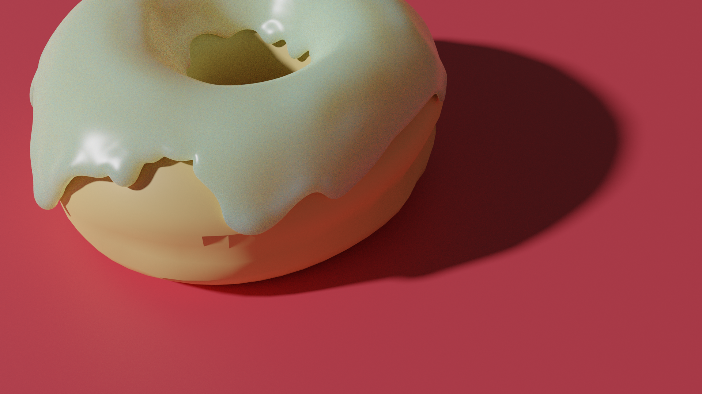

last updated Tue Jun 16 11:42:36 +08 2020

# Simulation for Robotics
summer 2020 ARC simulations for nvidia's isaac_sdk. This document serves as a basic installation/quickstart guide.
The relevant commands have been extracted out, please follow the links provided for further reading if required.

- [Simulation for Robotics](#simulation-for-robotics)
  - [Motivation](#motivation)
    - [System Requirements](#system-requirements)
    - [Isaac & Isaac Sim SDK](#isaac--isaac-sim-sdk)
    - [Simulation Environment: UnityHub and Unity 3D](#simulation-environment-unityhub-and-unity-3d)
    - [Troubleshooting Tips/Hacks](#troubleshooting-tipshacks)
  - [B: Testing Your Setup](#b-testing-your-setup)
  - [C: Basic Workflow](#c-basic-workflow)
    - [1. Running Scenes in Play/Build Mode](#1-running-scenes-in-playbuild-mode)
    - [2. Editing 3D Scenes in Unity Editor](#2-editing-3d-scenes-in-unity-editor)
  - [D: Codelets and Apps](#d-codelets-and-apps)
    - [IsaacSight Related](#isaacsight-related)
    - [Setting up Virtual Gamepad](#setting-up-virtual-gamepad)
    - [Segmentation Training](#segmentation-training)
  - [E: Collaboration Tools](#e-collaboration-tools)
    - [Unity's Collaboration  Features](#unitys-collaboration-features)
    - [Making/Modifying Assets](#makingmodifying-assets)
      - [Sources For Assets](#sources-for-assets)
      - [MapsSDK](#mapssdk)
      - [EasyRoads3D](#easyroads3d)
      - [other smol stuff](#other-smol-stuff)
  - [F: Todos](#f-todos)


## Motivation

The training of models benefits from simulations. We are able to generate unlimited data for the training of these models,
and have them all labelled in detail. Furthermore, we are able to randomise the light, materials, textures and colour of
our simulated objects. These should allow us to train and test our robots in a safe and controlled environment.
  
### System Requirements
* Ubuntu 18.04 LTS
* GPU with [compute capability](https://developer.nvidia.com/cuda-gpus) of 3.5 or higher

### [Isaac & Isaac Sim SDK](https://docs.nvidia.com/isaac/isaac/doc/setup.html#setup-isaac)
1. [Download](https://developer.nvidia.com/isaac/downloads) Isaac SDK 2020.1 and Isaac Sim (for Navigation) 2020.1, then extract the files to your home folder. (name them `~/isaac` and `~/isaac_sim_unity3d` respectively)
2. Ensure current version of NVIDIA GPU driver is version 440. To install, run the following commands in terminal

```bash
sudo add-apt-repository ppa:graphics-drivers/ppa
sudo apt-get update
sudo apt-get install nvidia-driver-440
```
3. From the root folder of Isaac SDK, run the dependency script. This will install the required dependecies

``` bash
bob@desktop:~/isaac$ engine/build/scripts/install_dependencies.sh
```

### Simulation Environment: UnityHub and Unity 3D
1. Download [UnityHub AppImage](https://unity3d.com/get-unity/download)
2. Give the AppImage executable permissions. In terminal, navigate to the folder containing UnityHub.AppImage and run the following command.
   
``` 
chmod +x UnityHub.AppImage
```
1. To open UnityHub, run the executable in terminal
```
./UnityHub.AppImage
```
4. Sign in to Unity Hub and activate personal or pro licence. Pro licence is available as part of the [github student developer pack](https://education.github.com/pack)
5. Run the following command in terminal to install Unity 2019.3.0f6 (no additional modules required).
```
./UnityHub.AppImage unityhub://2019.3.0f6/27ab2135bccf
```

### Troubleshooting Tips/Hacks
- Unable to build isaac app
  - Bazel version has to be 2.x. To check, run the following command in terminal. Running the dependency script again should fix this.
  ```
  bazel --version
  ```
- Unable to run NavSim
  - Cuda package's version has to be specifically 10.0, be careful when running `sudo apt update && upgrade` on your packages as this may upgrade cuda to a newer version. To check current version of Cuda, run the following command in terminal
  ``
  cat /usr/local/cuda/version.txt
  ``

- Unity unable to start
  - You may be missing a dependency. ``sudo apt install libgconf-2-4``

- Unable to import Sample Project into Unity
  -Follow the instructions [here](https://forums.developer.nvidia.com/t/isaac-sim-2020-1-unity-3d-unable-to-open-sample-project/126047). Delete the 4 files mentioned.

- Nvidia graphics driver installation failed.
  - You might have an older version of the driver. Remove old nvidia driver and try again

Others
- Ensure correct version of dependencies Bazel 2.x, CUDA 10.0, CUDNN 7.6.3, and TensorRT 6.0

- Substance plugin missing
  - Ensure ``Allogerithmic`` folder is present in your assets file. If missing, copy it from ``isaac_sim_unity3d/projects/sample/Assets``.
  
 - Logfile not printing to terminal, error message ``CreateDirectory '' failed:  (current dir: )`` shown.
  - modify the -logfile flag to ``-logfile /dev/stdout``
  
 - Visit [Isaac 2020.1 FAQ](https://docs.nvidia.com/isaac/isaac/doc/faq.html) and [Isaac SDK forum](https://forums.developer.nvidia.com/c/agx-autonomous-machines/isaac/sdk/68) for help :)

## B: Testing Your Setup

## C: Basic Workflow

### 1. Running Scenes in Play/Build Mode

### 2. Editing 3D Scenes in Unity Editor

## D: Codelets and Apps

### IsaacSight Related

### Setting up Virtual Gamepad

### Segmentation Training

## E: Collaboration Tools 

### Unity's Collaboration  Features

Unity Collab is Unity's own version control service. It's convenient to use and a setup for it is [described here](https://docs.unity3d.com/Manual/UnityCollaborateSettingUp.html).
It allows the syncing of 3D assets and other changes to the scenes. ***Note:*** only 3 people may use collab under the free service. 

Other version control systems are supported, including git, and using git would be beneficial.
[StackOverflow thread](https://stackoverflow.com/questions/18225126/how-to-use-git-for-unity3d-source-control) on git-Unity3D best practices.

**Suggestion:** consider dividing the asset-making todos and sync them using a github repo, while 3 people sync amongst each other on the Unity3D scenes

### Making/Modifying Assets 

Based on the supported [file types](https://docs.unity3d.com/Manual/3D-formats.html) for Unity3D, we have used `.fbx` files to create and import assets.

Blender is useful for this, but there's a learning curve. [Official Blender Fundamentals Playlist](https://www.youtube.com/playlist?list=PLa1F2ddGya_-UvuAqHAksYnB0qL9yWDO6)


*this donut took 2h*

#### Sources For Assets
Honestly, there's nothing good that's freely (and legally) available. Check out the assets subdir in this repo for some assets, add to it if you can.

#### MapsSDK

#### EasyRoads3D

#### other smol stuff

## F: Todos

* [Establishing a ROS Bridge](https://docs.nvidia.com/isaac/isaac/packages/ros_bridge/doc/ros_bridge.html)

* [map creation in unity](https://docs.mapbox.com/help/tutorials/create-a-map-in-unity/)

* [NVIDIA Omniverse](https://developer.nvidia.com/nvidia-omniverse-platform)

